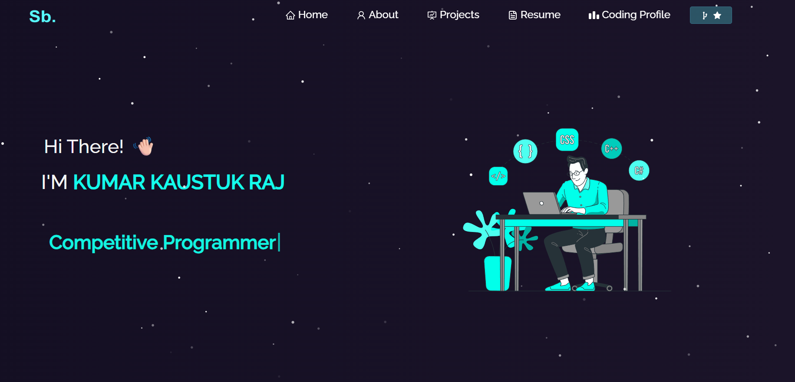
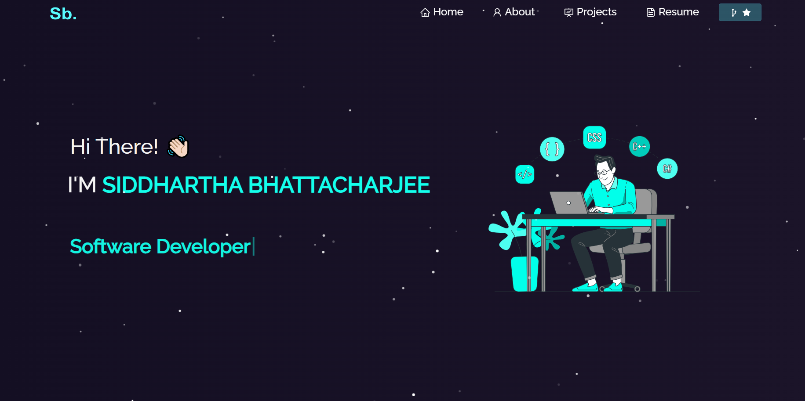

  

<h1 align="center">My Portfolio: A Small Dev Space in a Vast Digital World</h1>

  
  
  

---

Are you looking for a passionate and skilled backend/full-stack developer with strong problem-solving skills and a proven track record in competitive programming? If yes, then explore my portfolio — a digital snapshot of my journey through software engineering, system design, and algorithmic challenges.

🛠️ **Built with**: React.js, Bootstrap, tsparticles, and React-Router  
🚀 **Deployed on**: Vercel  
📌 **Tech Focus**: Backend (Java, Spring Boot), Full-Stack (MERN), and DSA

---

### 🏠 Home

A quick intro to who I am — a Computer Science undergraduate from <strong>NIT Andhra Pradesh</strong>, passionate about backend systems, clean architecture, and scalable APIs. You’ll also find links to my GitHub, LeetCode, and Codeforces stats, plus animated visuals and a resume preview.

---

### 🙋 About Me

Get a deeper look into my background, tech stack, achievements, and learning journey. Highlights include:
- 2000+ DSA problems solved
- <b>Codeforces:</b> Candidate Master (Rating 1913)
- <b>LeetCode:</b> Guardian (Rating 2183, Global Rank: 11)
- Tech communities and workshop involvement

---

### 📄 Resume

Access my PDF resume or connect with me on:

- 🔗 [LinkedIn](https://www.linkedin.com/in/kaustuk-raj-63a240226/)
- 💻 [GitHub](https://github.com/Manasdbg123)
- ⚔️ [Codeforces](https://codeforces.com/profile/manasraj123)
- 🧠 [LeetCode](https://leetcode.com/u/manas-12345/)

---

### 💻 Projects

Explore my hands-on development work, including:

- ✅ **Sketch-to-Face with GAN**  
  U-Net + GAN-based transformation. 30% faster training and improved output realism.

- ✅ **Recipe Blog Platform**  
  Full-stack app (Node, MongoDB, Express). Includes admin panel, search, and CRUD.

- ✅ **Hospital Management System**  
  Java, Spring Boot, MySQL with RESTful APIs and secure authentication.

- ✅ **E-Commerce Cart System**  
  Java, JPA, Hibernate, and Spring. Features user sessions, checkout, and API integration.

> Each project includes a description, live demo (if available), and source code.

 

  

  <a href="https://Kaustuk-portfolio.vercel.app/">🌐 View My Live Portfolio</a>

---

## ©️ License

This website is licensed under the **MPL-2.0 License**.  
See [LICENSE.txt](LICENSE.txt) for more details.

---

## 📞 Contact Me

Feel free to reach out for collaborations, job opportunities, or tech conversations!

**👨‍💻 Kumar Kaustuk Raj**  
🔗 [LinkedIn](https://www.linkedin.com/in/kaustuk-raj-63a240226/)  
📬 Email available on resume or request
