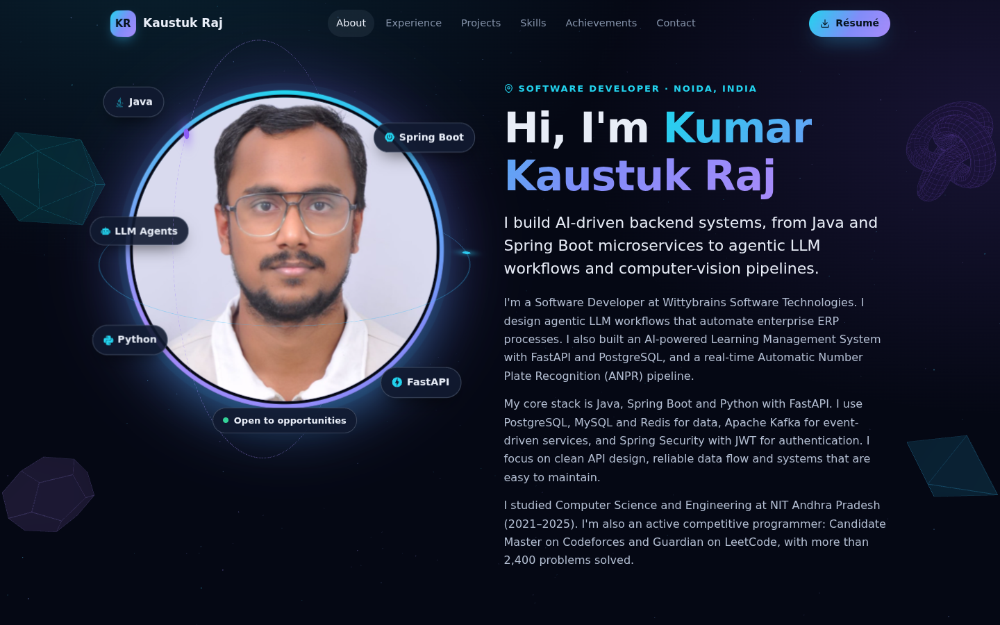

<p align="center">
  <a href="https://kaustuk-portfolio.vercel.app/">
    
  </a>
</p>

<h1 align="center">Kumar Kaustuk Raj · Portfolio</h1>

<p align="center">
  <a href="https://kaustuk-portfolio.vercel.app/">Live site</a> ·
  <a href="./public/Kaustuk_Raj_CV.pdf">Résumé</a> ·
  <a href="https://www.linkedin.com/in/kaustuk-raj-63a240226/">LinkedIn</a>
</p>

My personal site: a single, easy-to-follow page with a 3D background, built
with React and Three.js. It works on phones, tablets and desktops.

## What's on the page

1. **About** – who I am, what I do, key facts, ratings and a portrait.
2. **Experience** – my role at Wittybrains and my degree from NIT Andhra Pradesh.
3. **Projects** – the two projects from my résumé in detail, then more of my work, each linking to its code.
4. **Skills** – exactly the skills on my résumé, grouped by area.
5. **Achievements** – Codeforces Candidate Master (1913), LeetCode Guardian (2183), 2,400+ problems solved.
6. **Contact** – email, LinkedIn, GitHub, Codeforces, LeetCode and the résumé.

## Updating the content

All text lives in [`src/data/profile.js`](src/data/profile.js): experience,
projects, skills, achievements and links. Change it there and every section
follows. To update the résumé, replace `public/Kaustuk_Raj_CV.pdf`. The
portrait is `src/images/profile.jpg`, a square crop.

## 3D and performance

- A Three.js scene (star field and floating shapes) sits behind the page and
  responds to the pointer and to scrolling. Phones get fewer shapes and a lower
  pixel ratio, the animation pauses in background tabs, and without WebGL the
  page keeps its gradient background.
- The portrait sits inside orbiting CSS 3D rings, cards tilt towards the
  pointer, and sections enter with a 3D fold as you scroll.
- Visitors who turn on "reduce motion" get a still page.

## Running it

```bash
npm install
npm start        # http://localhost:3000
npm test         # smoke tests, including a check that no unlisted skills appear
npm run build    # production build in build/
```

Deployed on Vercel. `vercel.json` sends old `/resume` links to the PDF.
